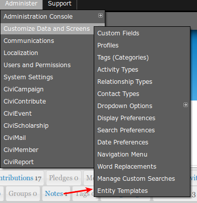

# Installation

Use the following steps to install this extension.
 * In CiviCRM, select **Administer menu » System Settings » Extensions**.
 * Select the **Add New** tab.
 * Click **Download** next to the *Entity Templates* extension.

After installation, you should have a new menu option available at the CiviCRM **Administration menu » Customize Data and Screens** called **Entity Templates**.  See screenshot:

## Extension Directory
View this extension in the [Extension Directory](https://civicrm.org/extensions/entity-templates).
